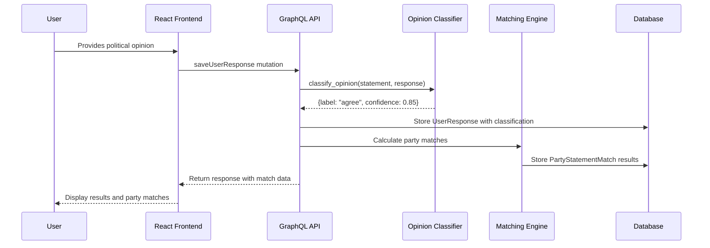
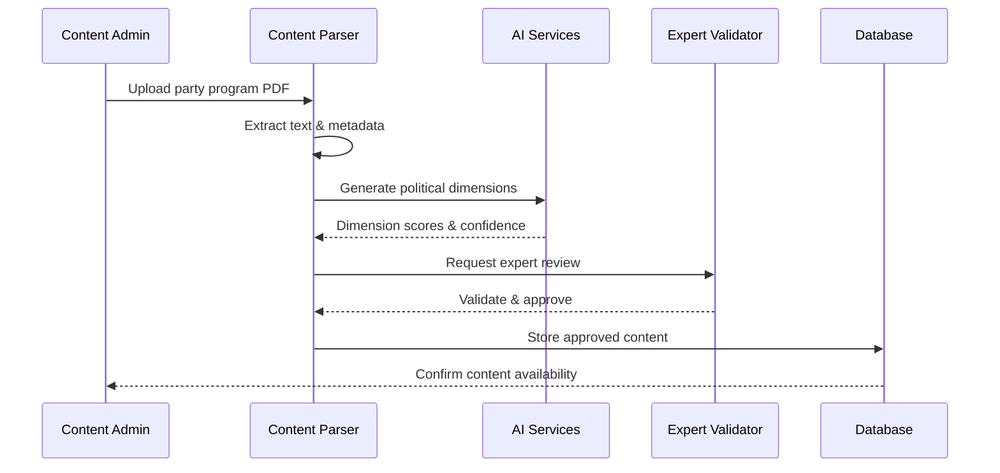
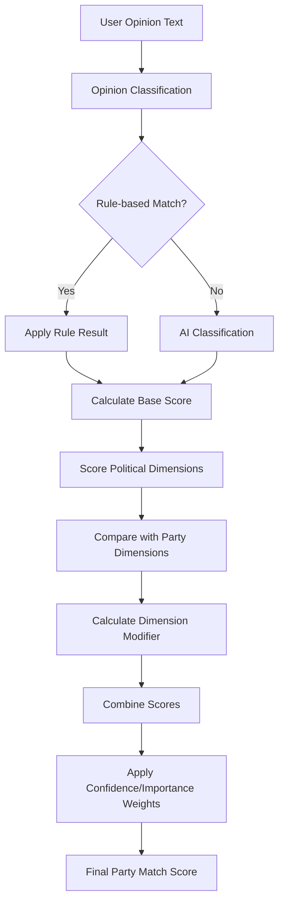

# System Architecture and Transparency

## Overview

This document provides a comprehensive overview of PolitiekMatcher's backend architecture, data flow, and transparency measures. It serves as a guide for understanding how the entire system works together to provide objective political analysis and matching.

## System Architecture Diagram

```
┌─────────────────────────────────────────────────────────────────────┐
│                           FRONTEND LAYER                            │
├─────────────────────────────────────────────────────────────────────┤
│ React + TypeScript + Apollo Client + Tailwind CSS                  │
│ - Chat Interface                                                    │
│ - Political Questionnaire                                           │
│ - Results & Matching Display                                        │
│ - Party Comparison Tools                                            │
└─────────────┬───────────────────────────────────────────────────────┘
              │ GraphQL API
              ▼
┌─────────────────────────────────────────────────────────────────────┐
│                          BACKEND LAYER                              │
├─────────────────────────────────────────────────────────────────────┤
│                        Django + GraphQL                             │
│ ┌─────────────┬─────────────┬─────────────┬─────────────────────────┐│
│ │    API      │   Content   │   Profiles  │       Utilities         ││
│ │  (GraphQL)  │   Models    │   & Auth    │     & Services          ││
│ │             │             │             │                         ││
│ │ • Query     │ • Parties   │ • Users     │ • Opinion Classifier    ││
│ │   Resolvers │ • Statements│ • Responses │ • Political Dimensions  ││
│ │ • Mutations │ • Programs  │ • Matches   │ • OpenAI Integration    ││
│ │ • Types     │ • Positions │ • Analytics │ • Matching Algorithm    ││
│ └─────────────┴─────────────┴─────────────┴─────────────────────────┘│
└─────────────┬───────────────────────────────────────────────────────┘
              │
              ▼
┌─────────────────────────────────────────────────────────────────────┐
│                         DATA LAYER                                  │
├─────────────────────────────────────────────────────────────────────┤
│ PostgreSQL Database                   Machine Learning Models        │
│ ┌─────────────────────────────────┐   ┌───────────────────────────┐ │
│ │ • Political Parties             │   │ • Opinion Classifier      │ │
│ │ • Statements & Positions        │   │ • Political Dimensions    │ │
│ │ • Program Fragments             │   │   (7 specialized models)  │ │
│ │ • User Profiles & Responses     │   │ • Embedding Models        │ │
│ │ • Match Results & Analytics     │   │ • Fine-tuned Transformers │ │
│ └─────────────────────────────────┘   └───────────────────────────┘ │
└─────────────────────────────────────────────────────────────────────┘
              │
              ▼
┌─────────────────────────────────────────────────────────────────────┐
│                      EXTERNAL SERVICES                              │
├─────────────────────────────────────────────────────────────────────┤
│ • OpenAI API (GPT-4/4o-mini)                                       │
│ • Redis (Task Queue & Caching)                                     │
│ • Celery (Background Processing)                                    │
│ • Political Content Sources                                         │
└─────────────────────────────────────────────────────────────────────┘
```

## Data Flow Documentation

### 1. User Interaction Flow



### 2. Content Processing Flow



### 3. Matching Algorithm Flow



## Application Structure

### Backend Apps Organization

```
backend/apps/
├── api/                    # GraphQL schema and resolvers
│   ├── schema.py          # Main GraphQL schema
│   ├── types.py           # GraphQL type definitions
│   └── services.py        # Business logic services
├── content/               # Political content management
│   ├── models.py          # Parties, statements, programs
│   ├── management/        # Data import commands
│   └── migrations/        # Database schema changes
├── profiles/              # User profiles and matching
│   ├── models.py          # User responses and matches
│   ├── services.py        # Matching algorithms
│   ├── tasks.py           # Background processing
│   └── schema.py          # Profile-related GraphQL
├── chat/                  # AI chat functionality
│   ├── models.py          # Chat sessions and messages
│   └── services.py        # Chat AI integration
├── payments/              # Premium features
│   ├── models.py          # Subscriptions and billing
│   └── services.py        # Payment processing
├── scraping/              # Content collection
│   ├── scrapers.py        # Web scraping tools
│   └── processors.py      # Content processing
└── utils/                 # Shared utilities
    ├── classifier.py      # Opinion classification
    ├── match_opinions.py  # Matching algorithms
    └── llm.py            # AI/LLM utilities
```

### Model Relationships

```python
# Core content models
PoliticalParty ──┐
                 ├── StatementPosition ──── Statement
Topic ────────── ┘                    └── PoliticalDimensions
  │
  └── Theme ──── Statement ──── UserResponse ──── UserProfile
                      │              │
                      └─── PartyStatementMatch ──┘
                              │
                              └── PartyMatch
```

## Transparency Mechanisms

### 1. Algorithm Transparency

**Open Source Methodology:**
- All algorithm logic documented in code comments
- Step-by-step score calculation explanations
- Public documentation of all transformation functions
- Version control for algorithm changes

**Score Breakdown:**
```python
# Users can see detailed score breakdowns
{
    "match_explanation": {
        "base_score": 85,
        "dimension_modifier": -5,
        "final_score": 80,
        "confidence_factor": 0.8,
        "importance_factor": 1.0,
        "reasoning": "Strong agreement on core issue, minor dimensional differences"
    }
}
```

### 2. Data Source Transparency

**Source Attribution:**
```python
class ProgramFragment(models.Model):
    source_document = models.CharField()    # Original document name
    source_page_start = models.IntegerField()  # Exact page reference
    extraction_method = models.CharField()  # How content was processed
    validation_status = models.CharField()  # Expert review status
    last_updated = models.DateTimeField()  # Content freshness
```

**Content Lineage:**
- Every statement links to original source
- Processing timestamps maintained
- Expert validation tracking
- Update history preserved

### 3. AI Decision Transparency

**Opinion Classification:**
```python
# Users see classification reasoning
{
    "user_opinion": "Ik ben het eens met meer belasting op vervuiling",
    "classified_as": "agree",
    "confidence": 0.89,
    "method": "AI_classification",  # or "rule_based"
    "explanation": "Strong agreement language detected"
}
```

**Dimension Scoring:**
```python
# Detailed dimensional analysis
{
    "dimensions": {
        "economic": {"score": -0.3, "confidence": 0.8, "evidence": "tax policy reference"},
        "environmental": {"score": -0.9, "confidence": 0.95, "evidence": "pollution tax support"}
    }
}
```

### 4. Match Explanation System

**Automated Explanations:**
```python
class PartyExplanationService:
    def generate_explanation(party_match, statement_matches):
        """Generate comprehensive explanation of party match"""
        # Uses OpenAI to create personalized explanations
        # Includes specific examples from user responses
        # Highlights areas of agreement and difference
```

**Explanation Structure:**
- **Match Overview**: Overall compatibility percentage
- **Key Agreements**: Strongest areas of alignment  
- **Notable Differences**: Areas where user and party diverge
- **Topic Analysis**: Breakdown by political themes
- **Confidence Assessment**: How reliable the match is

## Quality Assurance Framework

### 1. Data Quality Controls

**Automated Validation:**
```python
def validate_political_content():
    """Comprehensive content validation"""
    # Check for required metadata
    # Validate source attribution
    # Ensure dimensional scoring completeness
    # Flag potential quality issues
```

**Expert Review Process:**
1. **Initial Processing**: Automated content extraction
2. **Quality Check**: Automated validation rules
3. **Expert Review**: Political science expert validation
4. **Publication**: Approved content goes live
5. **Monitoring**: Ongoing quality monitoring

### 2. Algorithm Testing

**Test Suites:**
```python
class MatchingAlgorithmTests(TestCase):
    def test_perfect_agreement_scoring(self):
        """Test that identical positions score 100%"""
    
    def test_complete_disagreement_scoring(self):
        """Test that opposite positions score appropriately"""
    
    def test_dimensional_modifier_calculation(self):
        """Test political dimension impact on scores"""
```

**Validation Methods:**
- **Unit Tests**: Individual algorithm components
- **Integration Tests**: End-to-end matching workflows  
- **Expert Validation**: Political scientists review results
- **User Feedback**: Continuous validation from user experiences

### 3. Bias Detection and Mitigation

**Systematic Monitoring:**
```python
def detect_algorithmic_bias():
    """Monitor for systematic biases in matching"""
    # Check for party favoritism
    # Ensure balanced representation
    # Monitor demographic impacts
    # Flag unusual patterns
```

**Mitigation Strategies:**
- **Balanced Training Data**: Equal representation across political spectrum
- **Regular Audits**: External review of algorithm performance
- **Transparency Reports**: Public documentation of bias testing
- **Corrective Actions**: Algorithm adjustments when bias detected

## Privacy and Security Architecture

### 1. Data Protection

**User Privacy:**
```python
class UserProfile(models.Model):
    # No personal identifiers required
    uuid = models.UUIDField(primary_key=True)  # Anonymous identifier
    session_key = models.CharField()           # Session-based tracking
    email = models.EmailField(null=True)       # Optional, for save/restore
```

**Data Minimization:**
- Only collect necessary data for functionality
- Anonymous by default, optional identification
- Automatic data expiration for inactive users
- User-controlled data deletion

### 2. Security Measures

**API Security:**
```python
# GraphQL with built-in protections
- Query complexity analysis
- Rate limiting per user/IP
- Input validation and sanitization
- CORS restrictions for frontend
```

**Data Security:**
- **Database Encryption**: All sensitive data encrypted at rest
- **API Encryption**: TLS/HTTPS for all communications
- **Access Controls**: Role-based access to administrative functions
- **Audit Logging**: Complete audit trail of data access and changes

## Monitoring and Analytics

### 1. System Performance

**Key Metrics:**
```python
# System health monitoring
{
    "api_response_times": "< 200ms average",
    "classification_accuracy": "> 85%",
    "user_satisfaction": "> 4.0/5.0",
    "system_uptime": "> 99.5%"
}
```

### 2. Political Analysis

**Aggregate Insights:**
- Political trend analysis (anonymized)
- Opinion distribution across demographics
- Party position evolution tracking
- User engagement patterns

**Research Support:**
- Anonymized data for academic research
- Political science collaboration
- Public policy insights
- Democratic engagement analysis

This comprehensive architecture ensures that PolitiekMatcher operates as a transparent, reliable, and ethical platform for political engagement and analysis.
